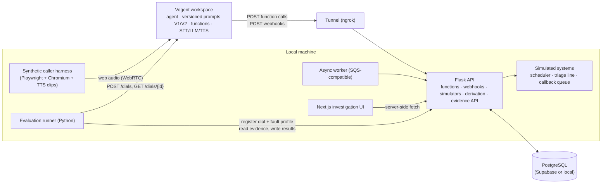
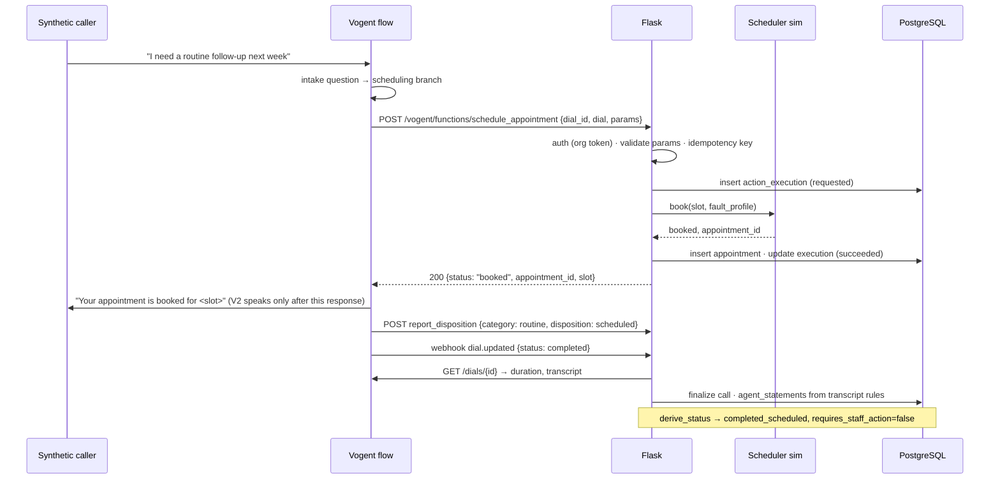

# Architecture

Owner of: system boundaries, request flow, failure semantics, correlation model, observability,
deployment boundary. Data model → `DATA_MODEL.md`. HTTP contracts → `API_DESIGN.md`.

## 1. Problem statement

A practice's voice agent marks calls "resolved" after telling callers that a transfer, callback, or
appointment happened. Some of those actions never happened. Staff cannot tell which calls still need a
human without opening each one. Routine scheduling must keep working while this is fixed.

## 2. Core invariant

**An agent's promise is not evidence that the action occurred.** Completion is derived only from the
function request/response the backend handled and the state of the (simulated) downstream system.
The transcript is evidence of what the caller was *told*, never of what was *done*.

The system keeps eight concepts distinct. Each has one place where it is recorded.

| # | Concept | Recorded as | Example (scenario C) |
|---|---------|-------------|----------------------|
| 1 | Caller intent | `calls.agent_classified_intent` (from the function the agent chose / `report_disposition`); `calls.true_intent` for evaluation calls only | post-operative concern |
| 2 | Agent promise | `agent_statements` rows (transcript rules + `report_disposition` params) | "I'm connecting you to triage" |
| 3 | Requested action | `action_executions.request_payload`, `requested_at` | Vogent POSTed `transfer_triage` |
| 4 | Attempted action | `action_executions.attempts` (each simulator attempt, latency, result) | one attempt, 1.9 s, failed |
| 5 | Actual action result | `action_executions.outcome`, `response_payload` | `failed`, reason `no_answer` |
| 6 | Persisted downstream state | `appointments`, `transfer_sessions`, `callback_requests` | callback `created`, urgent |
| 7 | Derived call status | computed by `derive_status()` from 3–6 | `callback_pending` |
| 8 | Required human action | `requires_staff_action`, `next_step` from the same function | "Call patient back within SLA" |

## 3. Goals and non-goals

Goals: authoritative evidence for every action; deterministic, explainable status; every call
reconstructable from persisted rows; reproducible agent configuration and evaluations; a narrow
vertical slice that genuinely works end to end on real Vogent voice calls; safe, fully synthetic data.

Non-goals: real EHR/scheduler/telephony integration; clinical triage logic beyond the one fictional
policy; production authentication and authorization; broad analytics; multi-region or high-availability
infrastructure; live AWS deployment (designed, not deployed).

## 4. System context



## 5. Component responsibilities

| Component | Owns | Does not own |
|-----------|------|--------------|
| Vogent | Speech recognition, flow/LLM orchestration, speech output, function invocation, dial records (duration, transcript) | Any business truth about actions |
| Flask API (`backend/`) | Validating Vogent requests, organization resolution, idempotency, invoking simulators, persisting evidence, deriving status, serving evidence to UI and evaluator | Conversation wording |
| Simulators (`backend/app/simulators/`) | Deterministic synthetic outcomes for scheduler, triage line, callback queue, under a per-dial fault profile | Persistence (they return results; the service layer persists) |
| PostgreSQL | Persisted evidence and simulated system state; uniqueness constraints that protect correctness | Derivation logic |
| `derive_status()` (`backend/app/domain/`) | Staff-visible operational truth, computed from rows, pure and unit-tested | I/O |
| Next.js UI (`frontend/`) | Presentation of persisted evidence for investigation | Any derivation or write beyond `staff_actions` |
| Evaluation runner (`evals/`) | Scenario execution, dial creation, harness control, metric computation against authoritative state, artifact capture | Business logic |
| Worker (`worker/`) | Consuming evaluation jobs from a queue, invoking the runner in replay mode, recording results and controlled failures | Scenario definitions |

## 6. Request sequences

### 6.1 Routine scheduling (scenario A)



### 6.2 Post-operative concern, transfer fails, callback created (scenario C)

```mermaid
sequenceDiagram
    participant C as Synthetic caller
    participant V as Vogent flow (V2)
    participant F as Flask
    participant T as Triage line sim
    participant Q as Callback queue sim
    participant DB as PostgreSQL
    C->>V: "I had surgery Tuesday and the incision is bleeding"
    V->>F: POST transfer_triage {dial_id, dial, params}
    F->>DB: insert action_execution (requested)
    F->>T: connect(fault_profile.transfer = fail)
    T-->>F: failed (no_answer)
    F->>DB: insert transfer_session(failed) · update execution (failed)
    F-->>V: 200 {status: "failed", failure_reason}
    V->>C: "The transfer did not complete."   (edge: status ≠ connected)
    V->>F: POST create_callback {priority: urgent, phone}
    F->>Q: create(fault_profile.callback = create)
    Q-->>F: created, callback_id
    F->>DB: insert callback_request(created) · update execution (succeeded)
    F-->>V: 200 {status: "created", callback_id}
    V->>C: "A nurse will call you back at <number>."
    V->>F: POST report_disposition {disposition: callback_pending}
    Note over F,DB: derive_status → callback_pending, requires_staff_action=true,<br/>reason: transfer failed; urgent callback created
```

V1 differs at one point: after `transfer_triage` returns, V1 follows an unconditional edge to the
closing node and reports `disposition: resolved`. The backend still derives `escalation_failed`
(transfer failed, no callback). The dashboard shows the mismatch. That is the customer's bug, made visible.

## 7. Failure semantics

| Situation | Action outcome | Downstream state | Derived status | Staff action |
|-----------|----------------|------------------|----------------|--------------|
| Transfer connected | `succeeded` | `transfer_sessions.connected` | `completed_transferred` | none |
| Transfer failed, callback created | `failed`, `succeeded` | session `failed`; callback `created` | `callback_pending` | call patient (urgent) |
| Transfer failed, callback failed | `failed`, `failed` | session `failed`; no callback row | `escalation_failed` | call patient immediately |
| Transfer unverified (timeout), callback created | `unverified`, `succeeded` | session `unverified`; callback `created` | `callback_pending` | call patient; confirm whether triage received the call |
| Transfer attempted, flow never called callback (V1) | `failed` | session `failed` | `escalation_failed` | as above; flag `promise_mismatch` |
| Scheduling unavailable / rejected / unverified | `failed` / `rejected` / `unverified` | no appointment | `scheduling_incomplete` | schedule manually |
| Call ended with no function calls | — | — | `no_action_recorded` | review transcript, call back |
| Duplicate function POST | first execution's outcome returned | unchanged | unchanged | none; `duplicate_of_id` set |
| Backend unreachable for the call | Vogent gets an error/null | nothing | `no_action_recorded` (from webhook) | review |
| Staff completes callback | — | callback `completed` | `closed_by_staff` | none |

Retry policy: the backend never retries a transfer (a second ring on a triage line is a side effect;
policy says fall back to callback). It retries callback creation once on `timeout` because the callback
queue is idempotent on the request. Attempts are recorded in `action_executions.attempts`.

Timeouts: simulator budget 2 s per attempt; the function endpoint answers within 6 s worst case
(Vogent's function timeout is undocumented; assumed ≥ 10 s and verified in Phase 4). Business failures
are returned as HTTP 200 with a `status` field so the flow can branch on them; only authentication and
malformed envelopes get 4xx.

## 8. Correlation model

| Identifier | Origin | Propagates to |
|------------|--------|---------------|
| `scenario_id` | scenario YAML filename | `callAgentInput`, `fault_profiles`, `evaluation_cases`, artifact directory, logs |
| `evaluation_run_id` | runner (UUID) | `callAgentInput`, `calls`, `evaluation_cases`, worker job, logs |
| `dial_id` | Vogent `POST /dials` | `fault_profiles`, `calls.dial_id`, every function payload, webhooks, artifact filenames, logs |
| `call_id` | backend (UUID, 1:1 with `dial_id`) | `action_executions`, `agent_statements`, `staff_actions`, UI routes, logs |
| `action_execution_id` | backend | downstream records (`appointment_id`, `transfer_session_id`, `callback_id` reference it), function response, UI |
| `idempotency_key` | backend: sha256(`dial_id`, function name, canonical params) | `action_executions` unique constraint |
| `request_id` | backend per HTTP request | logs, error responses |
| `organization_id` | resolved from the function/webhook token | every table, every log line |
| `vogent_agent_id`, `versioned_prompt_id` | Vogent | `calls`, `evaluation_runs`, artifacts |

Artifact path convention: `artifacts/<bucket>/<evaluation_run_id>/<scenario_id>/<dial_id>.*`.

## 9. Observability

Structured JSON logs, one line per event, always carrying the correlation fields that exist at that
point (`request_id`, `organization_id`, `call_id`, `dial_id`, `action_execution_id`, `scenario_id`,
`evaluation_run_id`).

| Event | Emitted when | Extra fields |
|-------|--------------|--------------|
| `vogent.function.received` | function POST authenticated and parsed | `function`, `duplicate` |
| `vogent.function.rejected` | auth failure or malformed envelope | `reason` |
| `action.requested` | execution row inserted | `kind`, `idempotency_key` |
| `action.attempt` | each simulator attempt | `attempt_no`, `latency_ms`, `result` |
| `action.completed` | outcome persisted | `outcome`, `downstream_ref` |
| `vogent.webhook.received` | webhook parsed | `event`, `status` |
| `call.finalized` | dial record fetched and call closed | `connected_seconds`, `system_result_type` |
| `status.derived` | derivation computed for a call | `status`, `requires_staff_action`, `promise_mismatch` |
| `evaluation.run.started` / `.completed` / `.failed` | runner or worker | `strategy`, `versioned_prompt_id`, `wall_seconds` |
| `evaluation.case.completed` | one scenario finished | `mode`, `passed`, `connected_seconds`, `cost_usd` |
| `worker.job.received` / `.completed` / `.failed` | worker | `job_id`, `receive_count` |
| `request.rejected` | a 4xx the API meant to return: unknown route, wrong method, bad token | `reason_code`, `http_status` |
| `request.failed` | an unhandled exception, answered as 500 | `error_type` |
| `staff.action_recorded` | a staff member closed a callback | `kind` |

The principal events are above; a few narrower ones exist alongside them
(`action.duplicate_in_flight`, `call.transcript_scored`, `eval.dial_registered`,
`worker.started`, `worker.idle`) and carry the same correlation fields.

Never logged: function `params` free text, phone numbers, caller names, transcript text, tokens,
API keys, full `dial` objects. Payloads are persisted in the database (synthetic), not in logs.

## 10. Deployment boundary

| Runs where | Components |
|------------|------------|
| Local machine | Flask API, simulators, evaluation runner, harness (Chromium), Next.js dev server, worker, local SQS emulator (`moto`) |
| External SaaS (synthetic data only) | Vogent workspace (agent, versions, functions, dials), PostgreSQL on Supabase (or local Docker Postgres), ngrok tunnel |
| Designed, not deployed | AWS SQS + DLQ, ECS Fargate worker, CloudWatch, SSM Parameter Store (Terraform in `infra/terraform/`) |

## 11. Implemented, simulated, designed, production-required

- **Implemented in the take-home**: Flask evidence API, deterministic derivation, idempotency,
  organization scoping by token, Vogent V1/V2 flows, real browser voice evaluations, deterministic
  metrics, two measured evaluation strategies, investigation UI, local async worker with DLQ behavior.
- **Simulated**: scheduler, triage transfer line, callback queue, caller audio, fault injection, staff identity.
- **Designed but not deployed**: AWS queue/worker/logging/secrets path (Terraform, validated locally only).
- **Required for real production** (see `RISKS.md`): identity and authorization, signed Vogent requests,
  encrypted PHI handling and audit, real telephony transfer verification, EHR integration with
  reconciliation, alerting and on-call runbooks, retention policies, compliance review.
