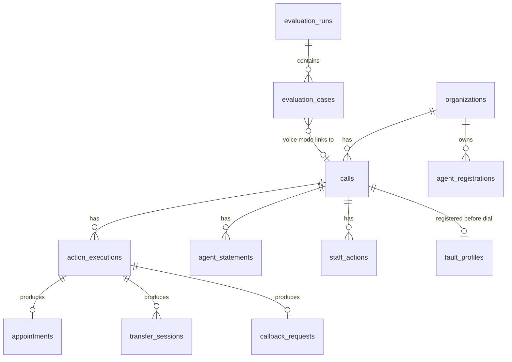

# Data Model and Status Semantics

Owner of: tables, constraints, action outcome states, derived call status. PostgreSQL 15+.
Schema lives in `backend/migrations/000N_*.sql` (plain SQL, applied in order by `make migrate`).

## 1. Design principles

- **Evidence rows are immutable once completed.** `action_executions` is insert-then-single-update
  (outcome filled in); `vogent_events` is append-only. Corrections are new rows, not edits.
- **Generalized execution + explicit final state.** One `action_executions` table records every tool
  call uniformly (request, attempts, outcome). Three small tables hold the state of the three simulated
  systems, because "what does the callback queue contain right now" must be answerable directly.
- **Derived status is never stored as truth.** It is computed from rows; a cached copy carries the hash
  of its inputs so staleness is detectable.
- **Every row carries `organization_id`.** No query runs without it.

## 2. Entity relationships

## 3. Tables

Types: `id uuid pk default gen_random_uuid()`, timestamps `timestamptz`, JSON as `jsonb`.

**organizations** — `id`, `slug` unique, `name`, `function_token_hash`, `webhook_token_hash`, `created_at`.

**agent_registrations** — `vogent_agent_id` pk, `organization_id` fk. A function request whose token
resolves to org X but whose `dial.agent.id` is registered to org Y is rejected.

**calls** — `id`, `organization_id`, `dial_id` unique, `vogent_agent_id`, `versioned_prompt_id`,
`scenario_id?`, `evaluation_run_id?`, `lifecycle` (`registered` | `in_progress` | `ended` |
`ended_unconfirmed`), `started_at?`, `ended_at?`, `connected_seconds?`, `system_result_type?`,
`agent_classified_intent?` (`routine_scheduling` | `post_operative_concern` | `other`),
`true_intent?` (evaluation calls only), `transcript?` (jsonb, non-authoritative), `derived_status_cache?`
(jsonb + `inputs_hash`), `created_at`, `updated_at`.
Constraint: `unique (organization_id, dial_id)`; `dial_id` globally unique as well.

**agent_statements** — `id`, `call_id`, `organization_id`, `kind`, `source` (`transcript_rule` |
`function_param`), `evidence_text` (bounded, synthetic), `sequence_no`, `observed_at`.
`kind` ∈ `promised_transfer`, `promised_callback`, `promised_appointment`, `disclosed_transfer_failed`,
`disclosed_callback_failed`, `reported_disposition`. Promises and disclosures are both statements; the
derivation treats them differently (§6).

**action_executions** — `id`, `call_id`, `organization_id`, `kind` (`schedule_appointment` |
`transfer_triage` | `create_callback` | `report_disposition`), `idempotency_key` unique,
`request_payload` (params only), `transcript_snapshot?` (if the `dial` object carries one),
`attempts` (jsonb array of `{attempt_no, started_at, latency_ms, result}`), `outcome`
(`requested` | `succeeded` | `failed` | `unverified` | `rejected`), `response_payload`, `downstream_ref?`,
`duplicate_of_id?` fk self, `requested_at`, `completed_at?`, `request_id`.
Constraints: `idempotency_key` unique; check `completed_at is null or outcome <> 'requested'`.

**appointments** — `id`, `organization_id`, `action_execution_id` unique, `slot` (timestamptz),
`status` (`booked` | `cancelled`), `created_at`.

**transfer_sessions** — `id`, `organization_id`, `action_execution_id`, `destination` (`triage_line`),
`status` (`connected` | `failed` | `unverified`), `failure_reason?`, `attempt_no`, `created_at`.
The simulated line logs every attempt, like a PBX call-detail record.

**callback_requests** — `id`, `organization_id`, `action_execution_id` unique, `priority` (`urgent` |
`normal`), `reason_code`, `status` (`created` | `completed`), `completed_by?`, `completed_at?`, `created_at`.
A failed creation leaves **no row**; the failure lives in `action_executions.outcome = failed`.

**vogent_events** — `id`, `organization_id?`, `dial_id?`, `event_type` (`function.<name>` | `dial.updated`
| `dial.transcript`), `dedupe_key` unique, `payload`, `rejected_reason?`, `received_at`. Append-only.

**fault_profiles** — `dial_id` pk, `organization_id`, `scenario_id`, `evaluation_run_id`, `true_intent`,
`profile` jsonb (`{scheduler: book|unavailable|timeout, transfer: connect|fail|timeout|unverified,
callback: create|fail|timeout}`), `created_at`. Registered by the runner before the call. Absent → all succeed.

**staff_actions** — `id`, `call_id`, `organization_id`, `actor` (free text, simulated identity),
`kind` (`callback_completed` | `reviewed`), `note?`, `created_at`.

**evaluation_runs** — `id`, `suite`, `strategy` (`naive_voice` | `optimized` | `replay`),
`versioned_prompt_id`, `backend_git_sha`, `started_at`, `ended_at?`, `wall_seconds?`, `status`
(`running` | `completed` | `failed`), `error?`, `cost_label` (`ACTUAL_BILLED` | `CALCULATED_ESTIMATE`),
`rate_usd_per_second`, `rate_source`, `job_id?`.

**evaluation_cases** — `id`, `run_id`, `scenario_id`, `scenario_version`, `mode` (`voice` | `replay` |
`structural`), `dial_id?`, `call_id?`, `passed`, `metrics` jsonb, `started_at`, `ended_at`, `wall_seconds`,
`connected_seconds?`, `cost_usd?`, `artifact_path`, `cache_key`.
Constraint: `unique (run_id, scenario_id)`.

## 4. Action outcome states

| Outcome | Meaning | Set when |
|---------|---------|----------|
| `requested` | request persisted, simulator not yet answered | insert |
| `succeeded` | simulator confirmed the action and a downstream row exists | `booked` / `connected` / `created` / `recorded` |
| `failed` | simulator definitively refused | `unavailable` / `failed` |
| `unverified` | no definitive answer within budget | timeout, malformed simulator reply |
| `rejected` | request invalid (bad phone, unparseable date) — nothing attempted | validation |

Function response `status` values map onto these: `booked→succeeded`, `connected→succeeded`,
`created→succeeded`, `recorded→succeeded`, `unavailable→failed`, `failed→failed`,
`unverified→unverified`, `invalid_input→rejected`.

## 5. Derived call status (decision table)

`derive_status(call, executions, appointments, transfer_sessions, callback_requests, statements, staff_actions)`
returns `{status, severity, requires_staff_action, reason, next_step, promise_mismatch, evidence_refs}`.

Precedence: a `transfer_triage` execution anywhere in the call selects the post-operative rules even if
scheduling also happened (safety first). Otherwise scheduling rules. Otherwise no-action rules.

| # | Condition | Status | Severity | Staff action |
|---|-----------|--------|----------|--------------|
| 1 | `lifecycle in (registered, in_progress)` | `in_progress` | 0 | no (not shown in attention list) |
| 2 | staff action `callback_completed` exists and the referenced callback is `completed` | `closed_by_staff` | 0 | no |
| 3 | any transfer session `connected` | `completed_transferred` | 0 | no |
| 4 | transfer attempted, none connected, a callback `created` exists | `callback_pending` | 2 | yes — call the patient (urgent) |
| 5 | transfer attempted, none connected, no callback `created` | `escalation_failed` | 4 | yes — call the patient immediately |
| 6 | no transfer; appointment `booked` exists | `completed_scheduled` | 0 | no |
| 7 | no transfer; scheduling attempted, no booked appointment | `scheduling_incomplete` | 1 | yes — schedule manually |
| 8 | `agent_classified_intent = post_operative_concern` (from `report_disposition`) and no transfer attempted | `routing_gap` | 3 | yes — call the patient; review flow |
| 9 | `lifecycle in (ended, ended_unconfirmed)` and no executions | `no_action_recorded` | 3 | yes — review transcript, call back |

Overlay, evaluated after the table: `promise_mismatch = true` when any `promised_*` statement lacks the
matching success (`promised_transfer` without `connected`, `promised_callback` without `created`,
`promised_appointment` without `booked`) **or** a `reported_disposition` claims completion while rows
1–9 produced `requires_staff_action = true`. A mismatch forces `requires_staff_action = true` and adds
"agent's statement does not match recorded evidence" to `reason`.

"Completion" is therefore defined, not asserted: `completed_*` requires a downstream row in a success
state that references a `succeeded` execution. No transcript content can produce a `completed_*` status.

## 6. Evidence reconstruction

The evidence bundle for a call (`GET /api/calls/{call_id}`) is one query per table filtered by `call_id`
and `organization_id`, ordered by time, plus the derivation. Everything the UI shows and everything the
evaluator asserts comes from that bundle, so the two can never disagree about a call.
